## Aim

The aim of this simulation was to see if modifiers of reproduction have similar evolutionary dynamics as modifiers of development, and to look at the effect of variables such as population size, strength of selection and the proportion of positive vs negative mutations.

Disclaimer: I use the word "modifier" to mean "high noise modifier" a lot. Like if I say the modifier succeeded I mean the high noise allele took over the population... Sorry.

## Methods

I have written a very simple piece of python code. Each individual in the population has 2 loci, one that is considered for determining the fitness and one that I call modifier locus, which determines the phenotypic variability. I had to make a lot of arbitrary decisions and assumptions, but I think for the sake of just visualizing our point in the paper, it is good enough. See code below for detail.

```{python, eval=FALSE, python.reticulate = FALSE}
def experiment(modi_prop, num_gens, pop_size, mut_bias, sel_pressure, repr=True):
  '''
  The function takes:
    modi_prop = initial proportion of high noise modifier alleles
    num_gens = number of generations to run the simulation for
    pop_size = population size
    mut_bias = proportion of positive and negative mutations. 0 means 50-50, 1 means 15 positive, 85 negative.
    sel_pressure = exponent in the fitness function. the higher this number the higher the selection pressure, the less the chances a lower fitness individual gets to reproduct
    repr = if True, the new phenotype gets 'inherited', i.e. modifier of reproduction simulation
    
  Note: haploid, no recombination, non-overlapping populations, none of the fancy stuff. The modifier locus is unmutable.
  '''
  
  # SET UP INITIAL POPULATION
  phenotypes=np.ones(pop_size, dtype=np.float32) + 100 # The phenotypes in the starting population is all 100.
  modiloci=np.ones(pop_size, dtype=np.int64) # 1 means the distribution it is drawing from has an std of 1, ie low noist modifier allele
  modiloci[:int(pop_size*modi_prop)] = 2 # 2 means 2 std instead of 1, i.e. high noise modifier allele

  # MAIN FOR LOOP
  for g in range(num_gens):

    #modify phenotypes/genotypes they are one and the same
    new_phenotypes = (phenotypes + (np.random.normal(loc=0, scale=1, size=pop_size)-mut_bias) * modiloci).astype(np.float32)
    #this draws from a normal distribution with an std depending on the modifier locus. this is happening for all individuals at the same type. numpy magic
    fits = np.array([(f-np.min(new_phenotypes))/(np.max(new_phenotypes)-np.min(new_phenotypes)) for f in new_phenotypes]) **sel_pressure #fitness is just phenotype/genotype rescaled between 0 and 1 and raised to the sel_pressure power
    fits[fits<0] = 0

    #select parents, fitness proportional, based on the modified phenotypes
    parents_to_reproduce = sample(fits, pop_size)

    #copy selected parents, i.e. reproduction (no mutation)
    new_pop=new_phenotypes[parents_to_reproduce]
    new_modiloci=modiloci[parents_to_reproduce]

    #replace population, key part
    if repr:
      phenotypes = new_pop
    modiloci = new_modiloci

    if (sum(modiloci) == pop_size) or (sum(modiloci) == 2*pop_size): #if everyone is a high or low noise modifier, stop
      if modiloci[0] == 1:
        return 1, g  # low noise wins
      else:
        return 2, g # high noise wins

  return 0, g # neither wins
```

That is it! So in English, I create a bunch of individuals that all start from the same genotype/phenotype (simply a float), some of which are high noise modifiers, meaning that when it comes to creating variation, they draw from a wider distribution. Then, each generation, I modify the genotype/phenotype (the single float) of each individual, I calculate their fitnesses (higher the better), I select who reproduces and how many times, and I replace the population with copies of the selected individuals. Repeat. If I am simulating a modifier of reproduction, the "creating variation" step corresponds to development, and when I am replacing the population, the new phenotypes is not inherited. So, the average phenotype doesn't change in the population over time. On the other hand, if I am simulating a modifier of development, the "creating variation" step corresponds to mutations followed by phenotypic differences due to those mutations, and thus the new phenotypes get inherited. Thus, the average phenotype increases in the population over time.

Here are some visualisations to illustrate the point. Developmental modifier, Blue high noise modifier, orange low noise modifier, triangle selected for reproduction. Density plot on the right: distribution of phenotypes for each of the modifier alleles. Blue is wider but the mean is the same, as in this run prob of negative and positive mutation were the same. note no change in average phenotype over time. y axis: phenotype, x axis: index of the individual in the population, ignore.

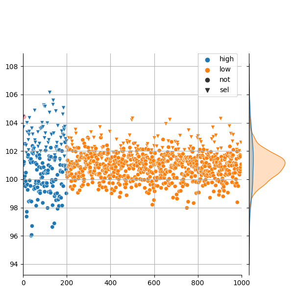 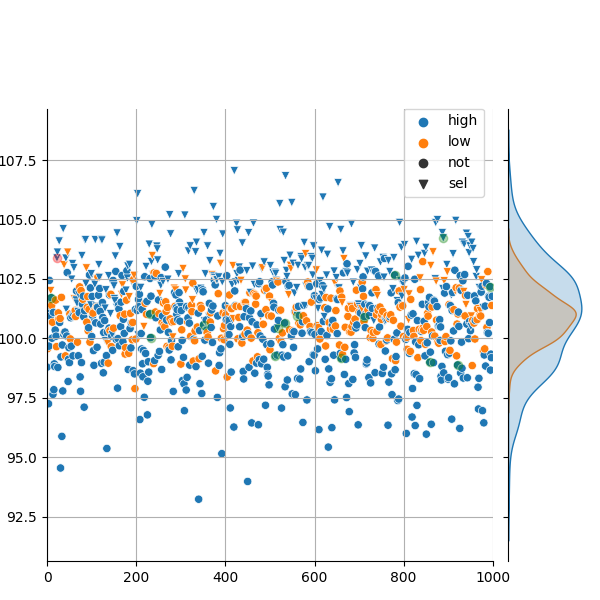 

Same but reproduction modifier. Note: average phenotype is increasing AND modifiers are able to gain more of an advantage then before. intuitive, they get to keep the advantage over the generations.

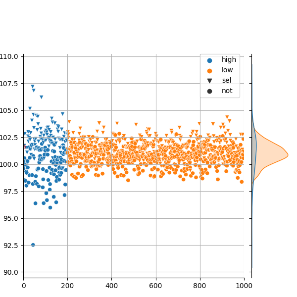 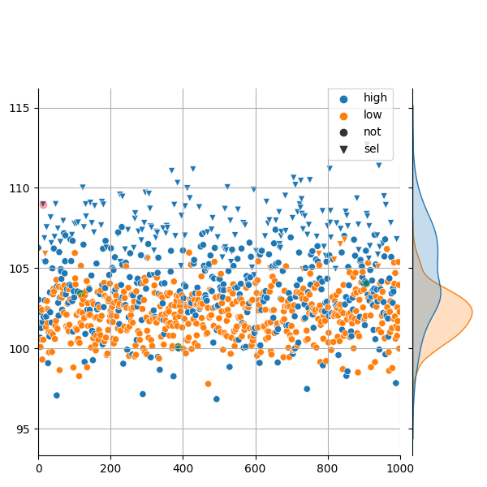 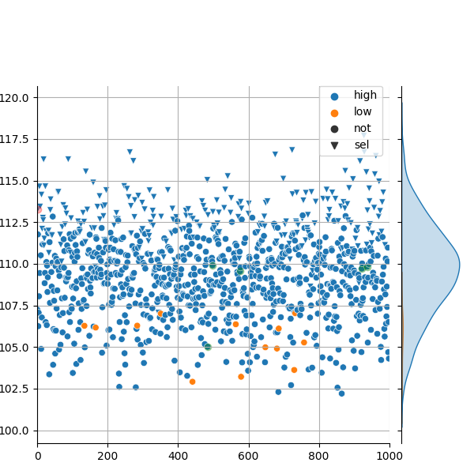

## Results

I run the simulation with 3 population sizes (100, 1.000, 10.000) 3 mutation biases (0, 0.5, 1), and 3 selection pressures (2, 10, 20) for 500 generations 100 times, starting with 1% of the population as the high noise modifier. Did this for both kinds of modifiers.

Here are the results for the number of times the high noise modifier managed to reach fixation (everyone in the end if a high noise modifier) out of the 100 times I repeated the simulation:

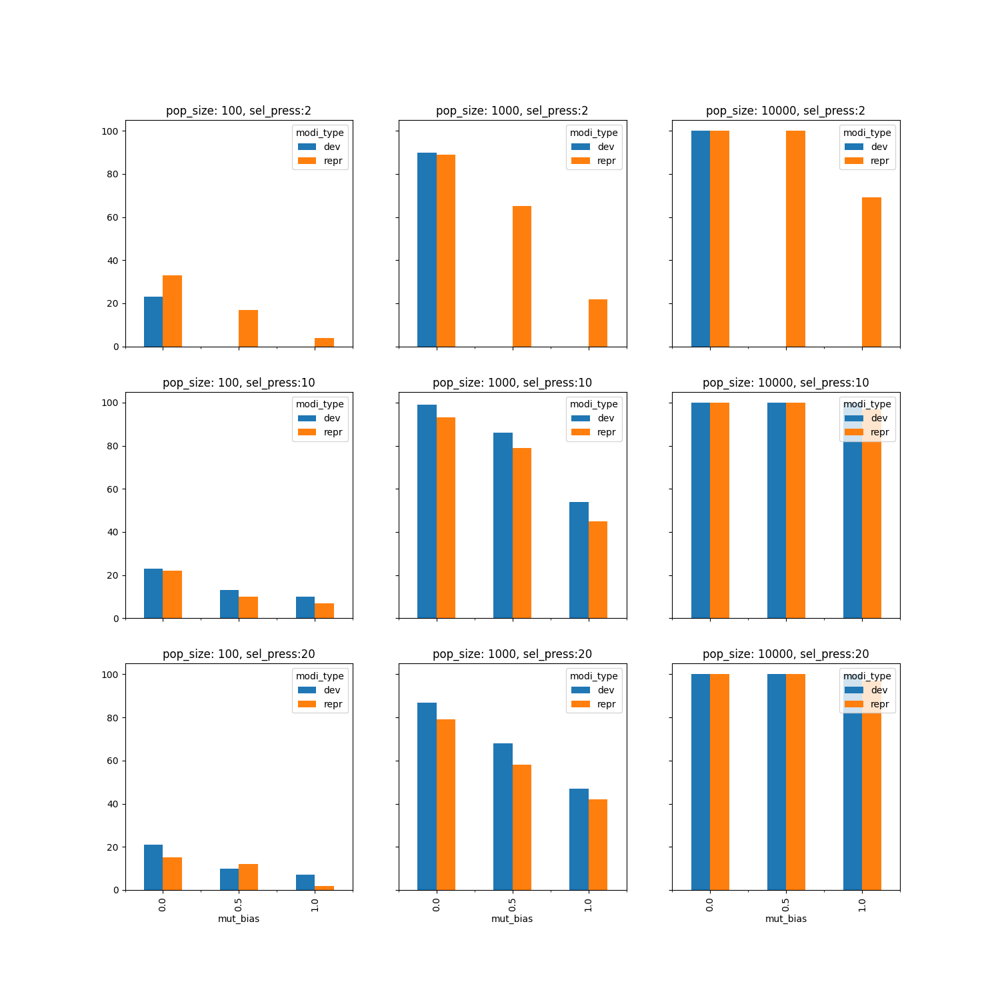

Main take-home:

-   population size helps both. yeyy, as we expected.

-   when the selection pressure is medium or high, dev and repr appear to behave similarly. when the selection pressure is lower, repr modifier still succeeds, but not the dev modifier. except for when the mutation rates are balanced. makes sense. when the selection pressure is low, modifiers with high fitnesses have less of an advantage. when the props worsen repr modifier can still succeed because it can maintain the advantage, but the dev can't.

- as expected, as I increase the probability of negative mutations, modifiers struggle more.

- dev modifiers do slightly better than repr modifiers at higher selection pressures? weird.

Now, let's plot the same results but with number of generations to fixation on the y axis. so, out of the times that the high noise modifier won, on average, how many generations did it take to win?

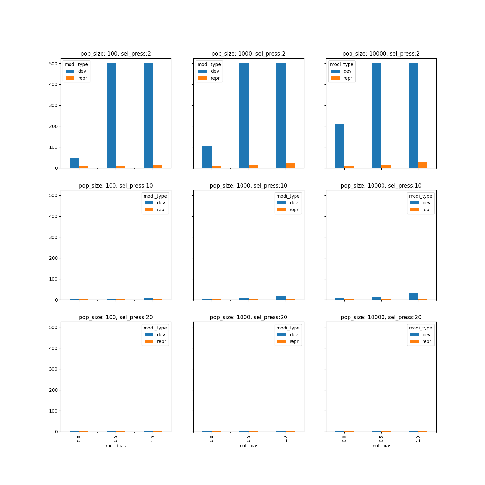

If the bars go up to 500, it means that they didn't end up fixing in the population. 

To be able to see the tiny bars, here is the same plot but with ylim set to 120.

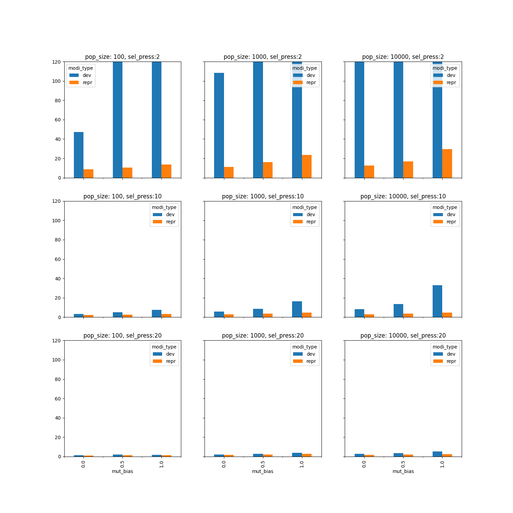

There is not as much to conclude here but I wanted to point out that:

- For pop size 10.000, medium and high selection pressure, even though both kinds of modifiers won 100% of the time, here you can see that dev modifiers take longer.

- For pop size 1.000, even though dev modifier won higher percentage of the time, they fixed in the population later. They just need more time it seems.

FYI just to illustrate the differences in selection pressures, these are the 3 settings I tested. Blue selected for reproduction. Right distributions: distribution of phenotypes of selected and not selected individuals. As you can see, when the selection pressure is really high (20) the low noise modifiers have basically no chance. In this case, only the best of the best are selected for reproduction, and it is much more likely that that is going to the a high noise modifier rather than a low noise modifier.

Selection pressures low, medium and high in this order:

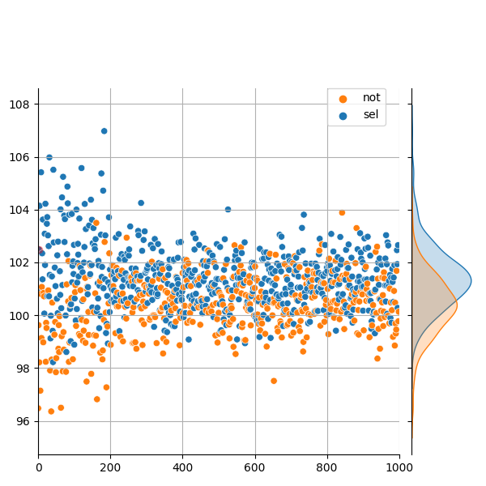
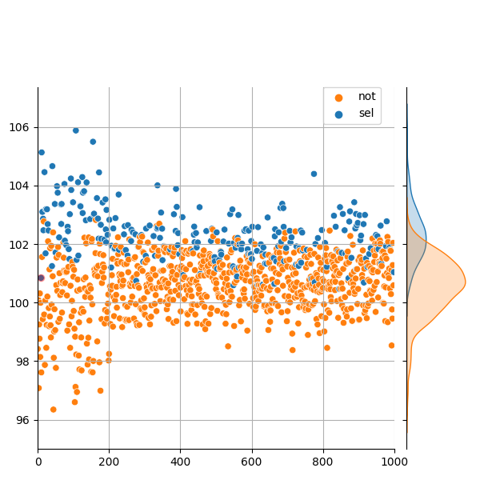
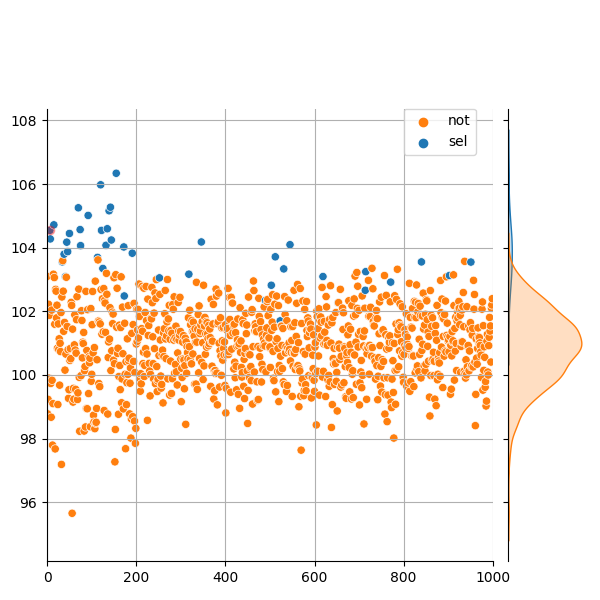


## Conclusion

I am quite satisfied with this! Of course, there are a lot of things I have ignored (e.g. that repr modifiers could have smaller effect than dev modifiers??), and I am sure you all could think of better ways of modeling the various parts of the evolution of modifiers. However, I do think it is an interesting toy model with explainable results that largely align with our intuition. What do you think?


