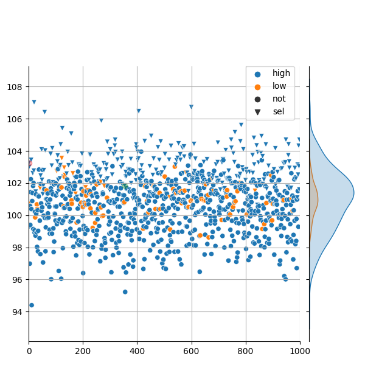
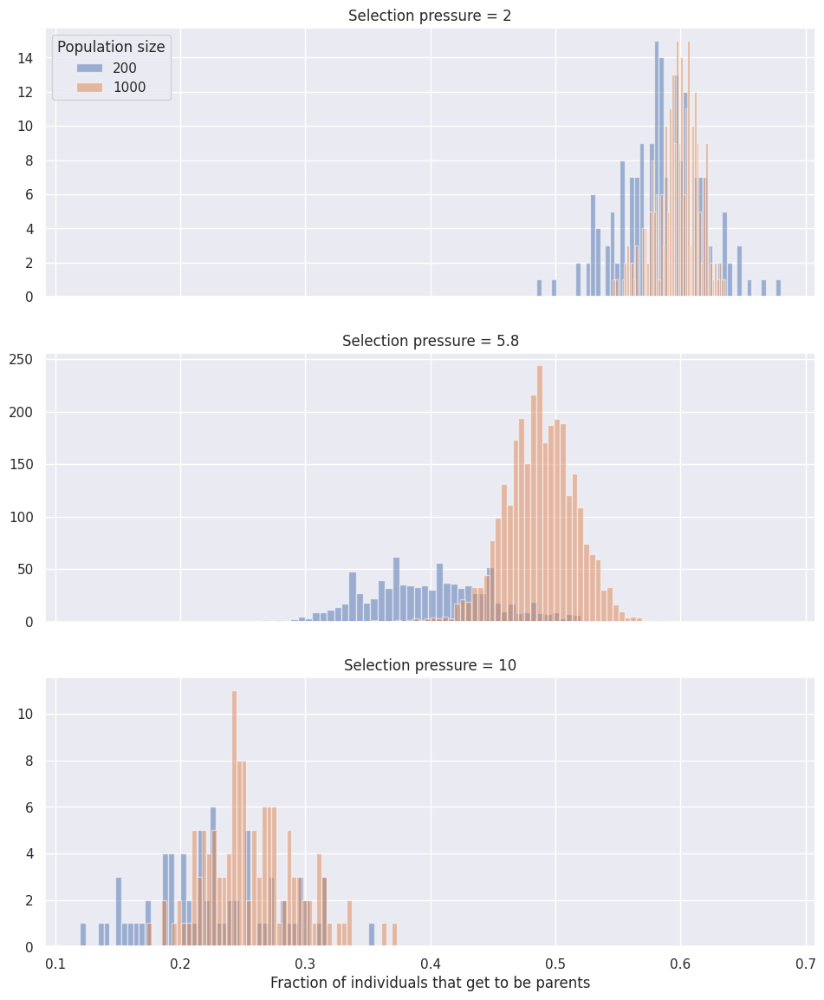
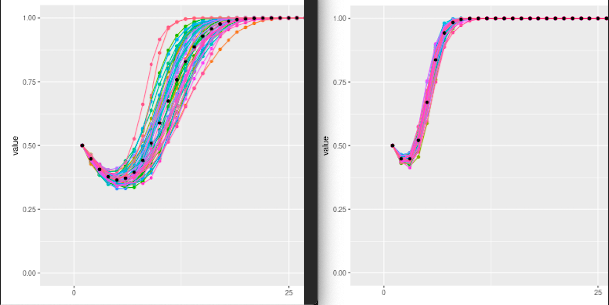

## Aim

The aim of this simulation was to see if modifiers of reproduction have similar evolutionary dynamics as modifiers of development, and to look at the effect of variables such as population size, strength of selection and the proportion of positive vs negative mutations.

Disclaimer: I use the word "modifier" to mean "high noise modifier" a lot. Like if I say the modifier succeeded I mean the high noise allele took over the population... Sorry.

## Methods

Here is the link to the collab: <https://colab.research.google.com/drive/1dn2mUJx-DqVHKmBXxoBbDd0fMNplXw_D?usp=sharing>. Note: parameter sweep experiments were done on a server but it used the same code slightly restructured such that different combinations of parameters can be tested in parallel.

I have written a very simple piece of python code. Each individual in the population has 2 loci, one that is considered for determining the fitness and one that I call modifier locus, which determines the phenotypic variability. I had to make a lot of arbitrary decisions and assumptions, but I think for the sake of just visualizing our point in the paper, it is good enough. See code below for detail.

```{python, eval=FALSE, python.reticulate = FALSE}
def experiment(modi_prop, num_gens, pop_size, mut_bias, sel_pressure, repr=True):
  '''
  The function takes:
    modi_prop = initial proportion of high noise modifier alleles
    num_gens = number of generations to run the simulation for
    pop_size = population size
    mut_bias = proportion of positive and negative mutations. 0 means 50-50, 1 means 15 positive, 85 negative.
    sel_pressure = exponent in the fitness function. the higher this number the higher the selection pressure, the less the chances a lower fitness individual gets to reproduct
    repr = if True, the new phenotype gets 'inherited', i.e. modifier of reproduction simulation
    
  Note: haploid, no recombination, non-overlapping populations, none of the fancy stuff. The modifier locus is unmutable.
  '''
  
  # SET UP INITIAL POPULATION
  phenotypes=np.ones(pop_size, dtype=np.float32) + 100 # The phenotypes in the starting population is all 100.
  modiloci=np.ones(pop_size, dtype=np.int64) # 1 means the distribution it is drawing from has an std of 1, ie low noist modifier allele
  modiloci[:int(pop_size*modi_prop)] = 2 # 2 means 2 std instead of 1, i.e. high noise modifier allele

  # MAIN FOR LOOP
  for g in range(num_gens):

    #modify phenotypes/genotypes they are one and the same
    new_phenotypes = (phenotypes + (np.random.normal(loc=0, scale=1, size=pop_size)-mut_bias) * modiloci).astype(np.float32)
    #this draws from a normal distribution with an std depending on the modifier locus. this is happening for all individuals at the same type. numpy magic
    fits = np.array([(f-np.min(new_phenotypes))/(np.max(new_phenotypes)-np.min(new_phenotypes)) for f in new_phenotypes]) **sel_pressure #fitness is just phenotype/genotype rescaled between 0 and 1 and raised to the sel_pressure power
    fits[fits<0] = 0

    #select parents, fitness proportional, based on the modified phenotypes
    parents_to_reproduce = sample(fits, pop_size)

    #copy selected parents, i.e. reproduction (no mutation)
    new_pop=new_phenotypes[parents_to_reproduce]
    new_modiloci=modiloci[parents_to_reproduce]

    #replace population, key part
    if repr:
      phenotypes = new_pop
    modiloci = new_modiloci

    if (sum(modiloci) == pop_size) or (sum(modiloci) == 2*pop_size): #if everyone is a high or low noise modifier, stop
      if modiloci[0] == 1:
        return 1, g  # low noise wins
      else:
        return 2, g # high noise wins

  return 0, g # neither wins
```

That is it! So in English, I create a bunch of individuals that all start from the same genotype/phenotype (simply a float), some of which are high noise modifiers, meaning that when it comes to creating variation, they draw from a wider distribution. Then, each generation, I modify the genotype/phenotype (the single float) of each individual, I calculate their fitnesses (higher the better), I select who reproduces and how many times, and I replace the population with copies of the selected individuals. Repeat. If I am simulating a modifier of reproduction, the "creating variation" step corresponds to development, and when I am replacing the population, the new phenotypes is not inherited. So, the average phenotype doesn't change in the population over time. On the other hand, if I am simulating a modifier of development, the "creating variation" step corresponds to mutations followed by phenotypic differences due to those mutations, and thus the new phenotypes get inherited. Thus, the average phenotype increases in the population over time.

With mut_bias == 1, 15% of the variation will be positive, for both high and low noise modifiers. I think this makes sense, but I am curious to hear what you think of this choice. Below are the distributions the random "mutations" are drawn from.


Here are some visualisations to illustrate the point. Developmental modifier, Blue high noise modifier, orange low noise modifier, triangle selected for reproduction. Density plot on the right: distribution of phenotypes for each of the modifier alleles. Blue is wider but the mean is the same, as in this run prob of negative and positive mutation were the same. note no change in average phenotype over time. y axis: phenotype, x axis: index of the individual in the population, ignore.

  

Below same but reproduction modifier. Note: average phenotype is increasing AND modifiers are able to gain more of an advantage then before. intuitive, they get to keep the advantage over the generations.

  

Same as above but with the 15% mut bias, developmental modifier: <https://www.dropbox.com/scl/fi/nrg4ofnb3qb9h7w6rxjoy/myvid.mp4?rlkey=e9cfucynwxqml9hxcklcwjyr8&dl=0>.

To illustrate the differences in selection pressures, these are the 3 settings I tested. Blue selected for reproduction. Right distributions: distribution of phenotypes of selected and not selected individuals. As you can see, when the selection pressure is really high (20) the low noise modifiers have basically no chance. In this case, only the best of the best are selected for reproduction, and it is much more likely that that is going to the a high noise modifier rather than a low noise modifier.

Selection pressures low, medium and high in this order:

  

## Main results

All my results point to the same main conclusion. The success of the high noise modifier depends on whether or not the positive phenotypes it generates "matter enough" to outweigh the effect of the negative phenotypes. There are many things that can influence this balance.

-   Is the phenotype heritable? If it is, the positive phenotype can matter more, as it can benefit the lineage for a longer period of time. In the case of reproduction modifiers, since positive phenotypes can be inherited, the high noise modifiers can get ahead of the low noise modifiers over time, and their mean phenotype could increase above the mean phenotype of the low noise modifiers. Thus, in later generations, they can start from a high point and so even if they get some bad mutations, they can still end up better off.

    -   Evidence: Well, the plots above already show this. Also, you can play with my visualisation tool <https://petakcsenge.shinyapps.io/test_shiny/> using the dataset available here: <https://github.com/Cpetak/cpetak.github.io/blob/master/eugene_sim_res_mutnomut.csv> and it will become apparent that the reproduction modifier wins in a wider subset of the parameter space than the developmental modifier.

-   This brings us to the second biggest factor that influences the success of the high noise modifier. Selection pressure. If the selection pressure is high, both kinds of modifiers have an easier time going to fixation. This is because with a high selection pressure, high fitness individuals get an unproportional boost in the probability of being selected, thus, if this boost is big enough, it can outweigh the effect of negative mutations. When only the top of the top gets selected, being in the top matters more, and as I wrote earlier, it is all about having the high fitness phenotypes "matter enough".

    -   Evidence: Plot below shows evidence for the first 2 claims. y axis is the percentage of the runs that ended with the high noise modifier going to fixation, starting from a population where half of the population is the high noise modifier. Increasing selection pressure helps both kinds of modifiers. Since developmental modifiers don't get to inherit benefitial phenotypes, they only go to fixation at higher selection pressure settings. (pop size = 1000, mutation bias = 2) 

-   Population size is another factor that determines how far a really good phenotype can get you. If the selection pressure is low, the modifier fails, if the selection pressure is high, the modifier wins, regardless of the population size. However, at in-between selection pressures, the size of the population can have a significant effect.

    -   Evidence #1: In developmental modifiers, high-noise alleles are favored in smaller populations, but are selected against in large populations.  In very small populations, drift causes the % wins to be closer to 50% (the starting frequency of the allele). However, in small populations, the high noise allele goes to fixation more frequently than expected based on the effect of drift. The advantage of the high noise modifier decreases as we increase population size. This is because as the "wheel of selection" gets populated with more individuals:
        -   Individuals with the highest fitness get proportionally less probability of being selected in larger populations than in smaller populations, hence the very good phenotypes don't get you ahead as much as they do when you share the wheel with less individuals. In the figure below, each slice corresponds to an individual (= probability of being selected if you spin the wheel, and it is proportional to the fitness of the individual), orange high noise, blue low noise modifier. This is what I mean by sharing the wheel. 
        -   In low selection pressure, around 60%, in high selection pressure, around 25% of the individuals in the population get to reproduce at least once, regardless of population size. However, at in-between selection pressure, in larger populations a higher percentage (50%) of the individuals gets to reproduce than in smaller populations (40%). In my opinion, this means that the size of the smaller slices become more important in larger populations. This is in the same vein as what Dan was talking about, i.e., the effect of deleterious mutations is larger in larger populations. 
    -   Evidence #2: In reproduction modifiers, high-noise alleles are increasing favored in larger populations. Of course, this difference comes from the fact that reproduction modifiers get to keep the good phenotypes that they are producing, and over the generations, the mean fitness of the high noise modifiers can become higher than the mean fitness of the low noise modifiers, and even with bad mutations a high noise modifier can end up having a higher fitness than a low noise modifier. As the population size increases, even if everything I wrote above for the developmental modifier applies here as well, those negative effect are outweighed by the positive effect of sampling more and finding really high beneficial phenotype that then the lineage "gets to keep". While the low noise allele also gets to sample more, the maximum phenotype they usually get gets smaller compared to the maximum phenotype the high noise allele is able to get as we increase the population size. 

Random notes:

Lapo

The non-linear scaling of fitnesses creates a "rich get richer" mechanism within a single selection step, furthermore there is another "rich get richer" effect because the lucky winners get to reproduce more and hence are more likely to win again in following generation. However, because the average effect of mutations is deleterious, this strategy is viable only when the modifiers can outcompete the wild type in a small population. It is our hypothesis (insert data supporting it here) that in a larger population the modifiers cannot capitalize on their advantage by trapping their opponents into an extinction-attractor. In larger population and in the absence of inheritance of generated phenotypes the wild type advantage allows them to consistently reach fixation in the long run.

Dan

The high noise modifier is an "aggressive" strategy that can quickly go to fixation in small populations, but in larger populations it takes longer and hence on the long term they are outcompeted.

Csenge

In larger populations a higher percentage of individuals will get to be parents. So it is no longer only the highest fitness individuals, but also there will be a chunk of the parents that have a lower fitness. These slightly lower fitness individuals that now get to reproduce are mostly be low noise modifiers. And this is going to tilt the balance in favor of the low noise modifier despite the highest fitness individuals still being high noise modifiers.

## Collection of other results

### The "illusion" of short vs long-term selection

In some parameter settings, we observed that the frequency of the reproductive high noise modifier goes down before going up later. I thought that this could be due to the ensemble "waiting" for a good mutation to appear. This is not the case. If I switch off mutations after the first generation, the pattern is still clearly there. This is because some high noise lineages will start from a good mutation, but they are a minority, so it takes some time for those lineages to increase in frequency (but they do 'deterministically', monotonically, +- drift but no down and then up necessarily) while all the other modifier lineages are going extinct so the overall frequency of the modifier decreases at first, but then increases later. This doesn't happen with the dev modifier because the parameters are either good enough for the high noise modifier to spread, or not. There can't be "hidden" lineages that are slowly taking over "in secret" like it is the case with the reproduction modifiers.  Left: Original, mutations occur in every generation. Right: Mutations are restricted to the first generation. High noise alleles are at an even better advantage without the load of the negative mutations.

### The actual effect of long-term selection: aka the effect of environmental variation.

What happens if the proportion of beneficial to deleterious phenotypes dynamically changes? For example, if the population is getting closer to a fitness optimum over the generations? (Only applicable to reproductive modifiers in this simulation.) So far, we have only considered the case where the proportion of good phenotypes is *always* 15% or 2%. Well, as you might expect, if the high noise modifier manages to go to fixation quickly, it doesn't matter that the proportion of positive mutations is decreasing since there is no longer any competition. However, if there are still some low noise modifiers left when the population gets close to a fitness optimum, after some initial increase in frequency of the high noise allele, it eventually goes extinct. Unless, the environment changes again before that happens. After the change in the environment the high noise allele is again at an advantage so it can increase in frequency again until the population gets near the fitness peak again. See plot below. Red lines: moving the fitness peak. X axis: generations, y axis: frequency of the modifier allele (5000 pop size). The simulation was stopped when the modifier went to fixation (hence the flat line at 230).  It was hard to find a parameter setting and a run where the two alleles coexisted for so long. One of the two alleles would go to fixation depending on the selection pressure, pop size, frequency of environmental change and the magnitude of the environmental change. Still, it was neat to see this form of balancing selection. At the beginning, high noise modifier decreases then increases in frequency like we saw before, but only until the population is still far from the peak, then it decreases in frequency until the environment changes at which point it increases again. Etc.

### Other things I tested for future reference

I tested whether things would look different if I did truncation selection instead of fitness proportional selection. Not really. It is complicated. So I just stick with fitness proportional selection. I also tested the effect of re-scaling the phenotypes to be between 0 and 1. No effect thankfully.
